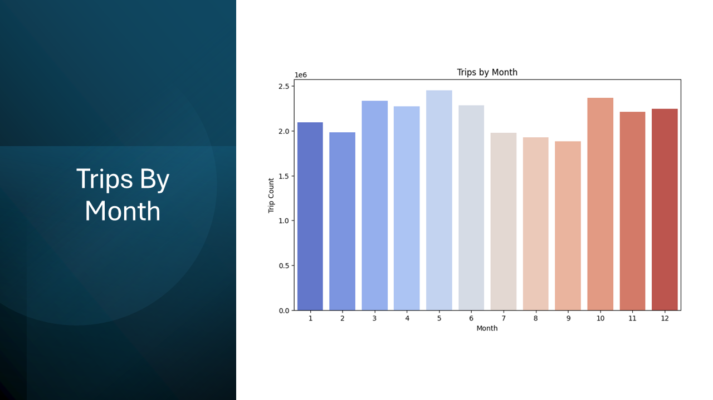

# NYC Taxi Data Analysis

## Overview

This project, developed by Me (Ujjwal), Prastut Dahal and Dipika Bogati, focuses on predictive modeling and machine learning insights derived from NYC Yellow Taxi Trip Records. The goal is to predict fare amounts, payment types, and forecast future demand and revenue using historical taxi data. These predictions aim to optimize resource allocation, enhance urban mobility, and support sustainable urban planning.

[View the full project presentation](Predictive_Paths.pdf)

### Presentation Preview


## Dataset

- **Source**: New York City Taxi & Limousine Commission (TLC) Yellow Taxi Trip Records
- **Description**: Open dataset containing millions of trip records from NYC yellow taxis.
- **Key Features**:
  - **Trip Details**: Pickup and drop-off locations, timestamps, trip distance
  - **Fare Information**: Total fare, trip amount, payment type
  - **Passenger Data**: Number of passengers per trip
  - **Time-Related Attributes**: Pickup time, drop-off time


## Methodology

### Data Cleaning

- Handled missing values by imputing or removing rows/columns as necessary.
- Removed duplicate rows to prevent skewed results.
- Identified and removed outliers in numerical features (e.g., extreme trip fares or durations).

### Feature Engineering

- Created new features such as trip duration, hour of day, and day of week.
- Encoded categorical variables using one-hot encoding or label encoding.


### Exploratory Data Analysis (EDA)

- Analyzed trip distribution by day of week and month.
- Visualized trends such as hourly demand and fare revenue patterns.




### Predictive Modeling

#### Regression Models (for Fare Amount Prediction)

- **Linear Regression**: Models linear relationships between features and target.
- **Lasso Regression**: Applies L1 regularization for feature selection.
- **Ridge Regression**: Uses L2 regularization to prevent overfitting.
- **Elastic Net**: Combines L1 and L2 regularization for balanced feature selection and coefficient shrinkage.


#### Classification Models (for Payment Type Prediction)

- **Logistic Regression**: Uses a sigmoid function to predict probabilities.
- **Decision Tree**: Captures linear and non-linear relationships through hierarchical splits.
- **Random Forest**: Combines multiple decision trees to improve prediction accuracy.
- **XGBoost**: Sequentially builds decision trees to optimize predictions via gradient descent.
  
  
  
  

### Forecasting

- Developed models to forecast future taxi demand and revenue based on historical data.
  
  
  
  
  

## Results

- **Prediction Accuracy**:
  - Achieved an accuracy of **83.3%** for classification tasks (e.g., payment type prediction).
  - Regression models showed a performance metric of **0.825** (likely R² or similar).
- **Key Insights**:
  - Successfully predicted fare amounts and payment types using trip features.
  - Forecasted future demand and revenue, validating the potential of regression and classification models.
  - Insights support improved efficiency and customer experience in urban transportation systems.

## Future Work

- Explore advanced machine learning models and deep learning for higher accuracy.
- Develop real-time prediction models to handle dynamic changes in demand and improve decision-making.


## Prerequisites

- Python 3.8+
- Required libraries:
  - pandas
  - numpy
  - scikit-learn
  - xgboost
  - matplotlib
  - seaborn

## Installation

1. Clone the repository:
   ```bash
   git clone https://github.com/ujjwalkuikel/NYC-Taxi-Data-Analysis.git
   cd NYC-Taxi-Data-Analysis
   ```
2. Install dependencies:
   ```bash
   pip install -r requirements.txt
   ```
3. Download the NYC TLC Yellow Taxi Trip Records dataset from the [official TLC website](https://www.nyc.gov/site/tlc/about/tlc-trip-record-data.page) and place it in the `data/` directory.

## License

This project is licensed under the GNU GENERAL PUBLIC LICENSE.
.
